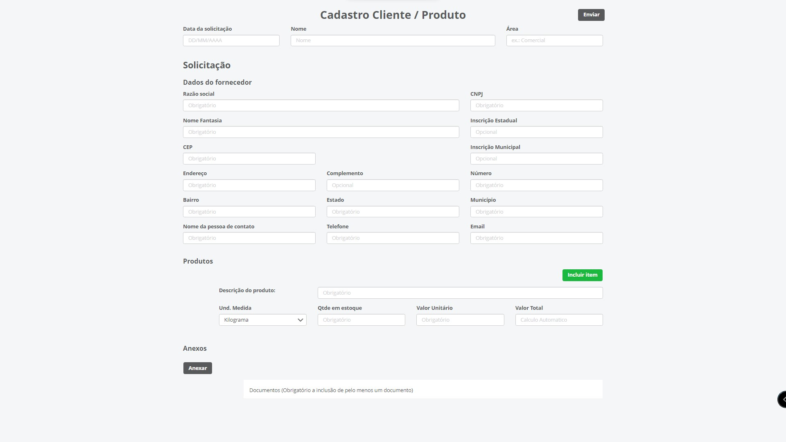

#### About

Customer/Order registration form
- Made with documentation of Fluig features and styles
- Address autocompletion via ViaCep API
- Verification of completion of required fields via JS
- Multiple attached items with the possibility of Download and delete before sending
- Storage of items in session Storage
- Sending the form in JSON format

Made by Nataniel Souza

#### languages and tools used

 - VS Code
 - CSS BootStrap
 - Html5
 - Javascript
 - Jquery
 - API ViaCep 

#### Preview

#### Contacts

📧 Email: nt.s@live.com   
👤 LinkedIn: [Nataniel Souza](https://www.linkedin.com/in/nataniel-souza)